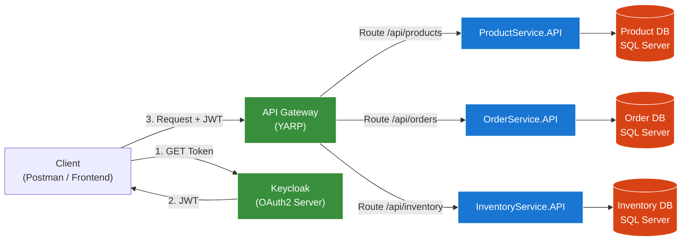

# Formation : Clean Architecture avec .NET 8
## Guide de Formation Complet — 3 Jours

> **Public cible :** Développeurs .NET avec 2 à 5 ans d'expérience  
> **Prérequis :** Connaissance de base de C#, ASP.NET Core, et une préparation de 2 jours à la Clean Architecture  
> **Durée :** 3 jours (théorie + démonstrations + labs pratiques)  
> **Projet fil rouge :** Système de microservices (ProductService · OrderService · API Gateway)

---

## Table des matières

- [Vue d'ensemble](#vue-densemble)
- [JOUR 1 — Fondamentaux et mise en place](#jour-1--fondamentaux-et-mise-en-place)
  - [Chapitre 1.1 — Principes de la Clean Architecture](#chapitre-11--principes-de-la-clean-architecture)
  - [Chapitre 1.2 — Configuration du projet .NET Core](#chapitre-12--configuration-du-projet-net-core)
  - [Lab 1 — ProductService : Structure et Domain Layer](#lab-1--productservice--structure-et-domain-layer)
- [JOUR 2 — Couches centrales, Adapters et Infrastructure](#jour-2--couches-centrales-adapters-et-infrastructure)
  - [Chapitre 2.1 — Application Layer : Use Cases et CQRS](#chapitre-21--application-layer--use-cases-et-cqrs)
  - [Chapitre 2.2 — Infrastructure Layer](#chapitre-22--infrastructure-layer)
  - [Chapitre 2.3 — API Layer avancée](#chapitre-23--api-layer-avancée)
  - [Lab 2 — ProductService : Application, Infrastructure et API complètes](#lab-2--productservice--application-infrastructure-et-api-complètes)
- [JOUR 3 — Tests, Sécurité et Sujets Avancés](#jour-3--tests-sécurité-et-sujets-avancés)
  - [Chapitre 3.1 — Tests dans la Clean Architecture](#chapitre-31--tests-dans-la-clean-architecture)
  - [Chapitre 3.2 — Sécurité avec JWT et OAuth2](#chapitre-32--sécurité-avec-jwt-et-oauth2)
  - [Chapitre 3.3 — Logging et Observabilité](#chapitre-33--logging-et-observabilité)
  - [Lab 3 — OrderService et Solution Globale](#lab-3--orderservice-et-solution-globale)
  - [Lab 4 — API Gateway avec YARP](#lab-4--api-gateway-avec-yarp)
- [BONUS — Sujets complémentaires](#bonus--sujets-complémentaires)
- [Ressources et références](#ressources-et-références)

---

## Vue d'ensemble

### Objectifs de la formation

| # | Objectif |
|---|----------|
| 1 | Maîtriser les 4 couches de la Clean Architecture et leur intégration dans .NET 8 |
| 2 | Implémenter des applications réelles en respectant l'inversion de dépendances |
| 3 | Appliquer des tests unitaires et d'intégration adaptés à la Clean Architecture |
| 4 | Sécuriser une API avec JWT et OAuth2 (Keycloak) |
| 5 | Optimiser pour des scénarios avancés : microservices, API Gateway, logging cloud-native |

### Planning des 3 jours

| Jour | Thème principal | Labs |
|------|----------------|------|
| **Jour 1** | Fondamentaux, Structure, Domain Layer | Lab 1 : ProductService — Structure + Domain |
| **Jour 2** | Application Layer, Infrastructure, API avancée | Lab 2 : ProductService complet |
| **Jour 3** | Tests, Sécurité JWT, Logging, Microservices | Lab 3 : OrderService + Lab 4 : API Gateway |

> La formation alterne **théorie expliquée**, **démonstrations live**, **exercices pratiques** et **discussions de cas réels**.  
> Chaque concept théorique est immédiatement appliqué dans un lab.

---

# JOUR 1 — Fondamentaux et mise en place

---

## Chapitre 1.1 — Principes de la Clean Architecture

### 🎯 Objectif
Comprendre pourquoi la Clean Architecture existe, quels problèmes elle résout, et comment elle s'organise.

---

### Pourquoi la Clean Architecture ?

Avant d'écrire du code, posons la question fondamentale : **Qu'est-ce qu'une mauvaise architecture ?**

Dans beaucoup de projets sans architecture claire, on retrouve ces problèmes :

- Le code métier est mélangé avec le code de la base de données
- Changer d'ORM (Entity Framework → Dapper) nécessite de tout réécrire
- Impossible de tester sans démarrer la base de données
- Un bug dans la couche UI casse la logique métier

La Clean Architecture, formalisée par **Robert C. Martin (Uncle Bob)**, répond à ces problèmes en séparant clairement les responsabilités.

---

### Le principe fondamental : la règle de dépendance

> **"Les dépendances doivent toujours pointer vers l'intérieur. Le code interne ne doit JAMAIS dépendre du code externe."**

Autrement dit :
- La logique métier ne connaît pas Entity Framework
- La logique métier ne connaît pas ASP.NET Core
- La logique métier ne connaît pas SQL Server

Si demain vous changez de base de données ou de framework, **le cœur de votre application ne change pas**.

```
┌─────────────────────────────────────────┐
│         Frameworks & Drivers            │  ← ASP.NET Core, EF Core, SQL Server
│  ┌───────────────────────────────────┐  │
│  │      Interface Adapters           │  │  ← Controllers, Repositories, DTOs
│  │  ┌─────────────────────────────┐ │  │
│  │  │     Use Cases               │ │  │  ← Logique applicative
│  │  │  ┌───────────────────────┐  │ │  │
│  │  │  │      Entities         │  │ │  │  ← Règles métier pures
│  │  │  └───────────────────────┘  │ │  │
│  │  └─────────────────────────────┘ │  │
│  └───────────────────────────────────┘  │
└─────────────────────────────────────────┘
         ↑ toutes les dépendances vont vers le centre
```

---

### Les 4 grandes couches

#### Couche 1 — Entities (Domain Layer)
**C'est le cœur de l'application.** Elle contient les règles métier pures.

- **Ce qu'elle contient :** Entités, Value Objects, interfaces du domaine
- **Ce qu'elle NE connaît PAS :** Base de données, HTTP, UI, framework
- **Exemple :** Un `Product` avec ses règles (le prix doit être positif)

#### Couche 2 — Use Cases (Application Layer)
**Elle orchestre la logique applicative.** Elle dit "quoi faire" mais pas "comment persister".

- **Ce qu'elle contient :** Services applicatifs, DTOs, interfaces de repositories
- **Ce qu'elle NE connaît PAS :** EF Core, SQL, ASP.NET Core
- **Exemple :** `CreateProductUseCase` qui valide, crée, et sauvegarde un produit

#### Couche 3 — Interface Adapters
**Elle fait le pont** entre la logique métier et le monde extérieur.

- **Ce qu'elle contient :** Controllers API, Presenters, Mappings (AutoMapper)
- **Son rôle :** Convertir les données du format externe vers le format interne et vice versa
- **Exemple :** `ProductsController` qui reçoit un JSON et appelle un Use Case

#### Couche 4 — Frameworks & Drivers (Infrastructure Layer)
**C'est la couche la plus externe.** Elle contient les détails techniques.

- **Ce qu'elle contient :** DbContext, Repository implementations, services externes
- **Son rôle :** Implémenter les interfaces définies dans les couches internes
- **Exemple :** `GenericRepository<T>` qui utilise EF Core pour accéder à SQL Server

---

### Comparaison avec d'autres architectures

| Caractéristique | Clean Architecture | DDD | Onion Architecture |
|---|---|---|---|
| **Principe central** | Inversion de dépendances | Modèle de domaine riche | Couches concentriques |
| **Complexité** | Moyenne | Élevée | Moyenne |
| **Focus** | Testabilité et indépendance | Langage ubiquitaire, Bounded Contexts | Séparation des couches |
| **Similitudes** | Domaine au centre | Domaine au centre | Domaine au centre |
| **Quand choisir** | APIs, microservices | Domaines complexes | Projets moyens |

> **En pratique :** La Clean Architecture emprunte des concepts DDD (Value Objects, Aggregates) et ressemble à l'Onion Architecture. Les trois partagent le même principe fondamental : **le domaine est indépendant**.

---

### Les 4 principes SOLID en Clean Architecture

La Clean Architecture s'appuie sur les principes SOLID. Voici les plus importants dans ce contexte :

| Principe | Nom complet | Application concrète |
|---|---|---|
| **S** | Single Responsibility | Chaque classe a une seule raison de changer |
| **O** | Open/Closed | Ajouter des features sans modifier le code existant |
| **L** | Liskov Substitution | Les implémentations sont interchangeables |
| **I** | Interface Segregation | Des interfaces spécialisées plutôt qu'une grosse interface |
| **D** | Dependency Inversion | **Dépendre d'abstractions, pas d'implémentations** |

> Le principe **D** est le plus critique : c'est lui qui permet de changer EF Core pour Dapper sans toucher à la logique métier.

---

### 🎯 Exercice théorique : Identifier les violations

Regardez ce code. Combien de violations de Clean Architecture voyez-vous ?

```csharp
// ❌ Code non-clean : à analyser
public class OrderController : ControllerBase
{
    [HttpPost]
    public async Task<IActionResult> CreateOrder(OrderDto dto)
    {
        // Logique métier directement dans le controller
        if (dto.Total < 0)
            return BadRequest("Total must be positive");

        // Accès direct à la base de données depuis le controller
        using var context = new AppDbContext();
        var order = new Order { Total = dto.Total, Date = DateTime.Now };
        context.Orders.Add(order);
        await context.SaveChangesAsync();

        // Envoi d'email directement couplé
        var smtp = new SmtpClient("smtp.gmail.com");
        smtp.Send("from@mail.com", dto.Email, "Confirmation", "Your order is confirmed");

        return Ok(order);
    }
}
```

**Violations identifiées :**
1. Logique métier (validation) dans le Controller → doit être dans le Domain
2. Accès direct à `DbContext` depuis le Controller → doit passer par un Repository
3. `SmtpClient` instancié directement → doit passer par une interface `IEmailService`
4. `new AppDbContext()` = couplage fort → doit être injecté via DI
5. Aucune séparation des responsabilités → impossible à tester unitairement

---

## Chapitre 1.2 — Configuration du projet .NET Core

### 🎯 Objectif
Savoir structurer un projet .NET 8 en respectant les couches de la Clean Architecture dès le départ.

---

### Structure de solution recommandée

Chaque microservice est une **solution indépendante** composée de 5 projets :

```
MyService/
├── MyService.sln
├── MyService.Domain/           ← Couche 1 : Entités, interfaces
│   ├── Entities/
│   ├── ValueObjects/
│   └── Interfaces/
├── MyService.Application/      ← Couche 2 : Use Cases, DTOs, Services
│   ├── Interfaces/
│   ├── Services/
│   ├── DTOs/
│   └── Validators/
├── MyService.Infrastructure/   ← Couche 4 : EF Core, Repositories
│   ├── Data/
│   └── Migrations/
├── MyService.API/              ← Couche 3 : Controllers, Program.cs
│   ├── Controllers/
│   └── Program.cs
└── MyService.Tests/            ← Tests unitaires et d'intégration
    └── Services/
```

---

### Règles de référencement entre projets

C'est ici que la règle de dépendance se concrétise dans Visual Studio :

| Projet | Référence | Raison |
|---|---|---|
| **Domain** | *(aucune)* | Cœur indépendant — ne dépend de rien |
| **Application** | → Domain | Utilise les entités et interfaces du domaine |
| **Infrastructure** | → Domain, Application | Implémente les interfaces définies dans Application |
| **API** | → Application, Infrastructure | Controllers → Application ; DI → Infrastructure |
| **Tests** | → Application, Domain | Teste la logique applicative et métier |

> ⚠️ **Règle absolue :** Le projet `Domain` ne référence JAMAIS `Infrastructure` ou `API`.  
> Si vous voyez `using Microsoft.EntityFrameworkCore` dans le Domain → c'est une violation.

---

### Injection de Dépendances (DI) en .NET Core

**Qu'est-ce que l'injection de dépendances ?**

Au lieu que chaque classe crée elle-même ses dépendances (`new Repository()`), le framework les fournit automatiquement. Cela permet :
- De changer l'implémentation sans modifier le code client
- De tester avec des mocks (fausses implémentations)
- De gérer la durée de vie des objets (Singleton, Scoped, Transient)

**Les 3 durées de vie :**

| Lifetime | Description | Cas d'usage |
|---|---|---|
| `Singleton` | Une seule instance pour toute l'application | Configuration, cache global |
| `Scoped` | Une instance par requête HTTP | DbContext, Repository, Services |
| `Transient` | Nouvelle instance à chaque injection | Utilitaires légers |

**Enregistrement dans `Program.cs` :**

```csharp
// Scoped : une instance par requête (recommandé pour les repositories et services)
builder.Services.AddScoped(typeof(IGenericRepository<>), typeof(GenericRepository<>));
builder.Services.AddScoped<IProductService, ProductService>();

// Singleton : une instance pour toute la vie de l'application
builder.Services.AddSingleton<IConfiguration>(builder.Configuration);
```

---

## Lab 1 — ProductService : Structure et Domain Layer

### 🎯 Objectif du lab
Créer la structure complète du projet `ProductService` et implémenter la couche Domain.

---

### Étape 1 — Créer la solution et les projets

```bash
# Créer le dossier racine
mkdir ProductService && cd ProductService

# Créer la solution
dotnet new sln -n ProductService

# Créer les projets
dotnet new classlib -n ProductService.Domain
dotnet new classlib -n ProductService.Application
dotnet new classlib -n ProductService.Infrastructure
dotnet new webapi -n ProductService.API
dotnet new xunit -n ProductService.Tests

# Ajouter les projets à la solution
dotnet sln add ProductService.Domain/ProductService.Domain.csproj
dotnet sln add ProductService.Application/ProductService.Application.csproj
dotnet sln add ProductService.Infrastructure/ProductService.Infrastructure.csproj
dotnet sln add ProductService.API/ProductService.API.csproj
dotnet sln add ProductService.Tests/ProductService.Tests.csproj

# Configurer les références (règle de dépendance)
dotnet add ProductService.Application reference ProductService.Domain
dotnet add ProductService.Infrastructure reference ProductService.Domain
dotnet add ProductService.Infrastructure reference ProductService.Application
dotnet add ProductService.API reference ProductService.Application
dotnet add ProductService.API reference ProductService.Infrastructure
dotnet add ProductService.Tests reference ProductService.Application
dotnet add ProductService.Tests reference ProductService.Domain
```

---

### Étape 2 — Domain Layer : Entité Product

**Pourquoi une entité "riche" ?**  
Dans la Clean Architecture, une entité n'est pas un simple conteneur de données. Elle **encapsule les règles métier** qui la concernent. Ainsi, les invariants (règles toujours vraies) sont garantis par le domaine lui-même, pas par le controller ou le service.

**`ProductService.Domain/Entities/Product.cs`**

```csharp
namespace ProductService.Domain.Entities;

public class Product
{
    public Guid Id { get; private set; }
    //[StringLenth(50,ErrorMessage(""))]
    public string Name { get; private set; }
    public decimal Price { get; private set; }
    public string Description { get; private set; }
    public int Stock { get; private set; }

    // Constructeur privé : force l'utilisation de la méthode factory
    private Product() { }

    /// <summary>
    /// Méthode factory : point d'entrée unique pour créer un Product valide.
    /// Les invariants sont vérifiés ici, garantissant qu'un Product invalide ne peut pas exister.
    /// </summary>
    public static Product Create(string name, decimal price, string description, int stock = 0)
    {
        if (string.IsNullOrWhiteSpace(name))
            throw new ArgumentException("Product name cannot be empty.", nameof(name));

        if (price <= 0)
            throw new ArgumentException("Price must be positive.", nameof(price));

        if (stock < 0)
            throw new ArgumentException("Stock cannot be negative.", nameof(stock));

        return new Product
        {
            Id = Guid.NewGuid(),
            Name = name,
            Price = price,
            Description = description ?? string.Empty,
            Stock = stock
        };
    }

    /// <summary>
    /// Méthode de mise à jour : contrôle les modifications autorisées.
    /// </summary>
    public void Update(string name, decimal price, string description)
    {
        if (string.IsNullOrWhiteSpace(name))
            throw new ArgumentException("Product name cannot be empty.", nameof(name));

        if (price <= 0)
            throw new ArgumentException("Price must be positive.", nameof(price));

        Name = name;
        Price = price;
        Description = description ?? string.Empty;
    }

    /// <summary>
    /// Règle métier : décrémenter le stock uniquement si suffisant.
    /// </summary>
    public void DecrementStock(int quantity)
    {
        if (quantity <= 0)
            throw new ArgumentException("Quantity must be positive.", nameof(quantity));

        if (quantity > Stock)
            throw new InvalidOperationException($"Not enough stock. Available: {Stock}, Requested: {quantity}");

        Stock -= quantity;
    }
}
```

> **Explication :** Le constructeur est `private` pour forcer l'utilisation de `Product.Create(...)`. Cela garantit qu'aucun `Product` invalide (prix négatif, nom vide) ne peut exister dans le système.

---

### Étape 3 — Domain Layer : Interface du Repository

**Pourquoi définir l'interface dans le Domain ?**

L'interface `IGenericRepository<T>` est définie dans le **Domain**, pas dans l'Infrastructure. Ainsi, la logique métier dépend de l'**abstraction** (l'interface), et non de l'**implémentation** concrète (EF Core). C'est l'application directe du principe **D** de SOLID.

**`ProductService.Domain/Interfaces/IGenericRepository.cs`**

```csharp
using System.Linq.Expressions;

namespace ProductService.Domain.Interfaces;

/// <summary>
/// Interface générique définissant le contrat d'accès aux données.
/// Définie dans le Domain pour que l'Application puisse en dépendre
/// sans connaître EF Core ou SQL Server.
/// </summary>
public interface IGenericRepository<T> where T : class
{
    /// <summary>
    /// Récupère une liste paginée avec filtrage et tri optionnels.
    /// </summary>
    Task<IEnumerable<T>> GetAllAsync(
        int pageNumber,
        int pageSize,
        Expression<Func<T, bool>>? filter = null,
        Func<IQueryable<T>, IOrderedQueryable<T>>? orderBy = null);

    Task<T?> GetByIdAsync(Guid id);
    Task AddAsync(T entity);
    Task UpdateAsync(T entity);
    Task DeleteAsync(T entity);
}
```

---

### Étape 4 — Installer les packages NuGet

```bash
# Infrastructure : EF Core
dotnet add ProductService.Infrastructure package Microsoft.EntityFrameworkCore.SqlServer
dotnet add ProductService.Infrastructure package Microsoft.EntityFrameworkCore.Tools
dotnet add ProductService.Infrastructure package Microsoft.EntityFrameworkCore.InMemory

# Application : AutoMapper + FluentValidation
dotnet add ProductService.Application package AutoMapper.Extensions.Microsoft.DependencyInjection
dotnet add ProductService.Application package FluentValidation

# API : FluentValidation integration + Swagger
dotnet add ProductService.API package FluentValidation.AspNetCore
dotnet add ProductService.API package Swashbuckle.AspNetCore
```

---

# JOUR 2 — Couches centrales, Adapters et Infrastructure

---

## Chapitre 2.1 — Application Layer : Use Cases et CQRS

### 🎯 Objectif
Comprendre et implémenter la couche Application avec les patterns Use Cases, DTOs, AutoMapper et CQRS.

---

### Qu'est-ce qu'un Use Case ?

Un **Use Case** (ou Interactor) représente **une action métier précise** que l'utilisateur peut effectuer. Il orchestre les entités du domaine et les appels aux repositories sans se soucier de comment les données sont affichées ou stockées.

**Exemples de Use Cases pour ProductService :**
- Créer un produit
- Mettre à jour un produit
- Lister les produits avec pagination
- Décrementer le stock d'un produit

Dans notre implémentation, les Use Cases sont encapsulés dans des **Services d'Application**.

---

### Qu'est-ce qu'un DTO ?

Un **DTO (Data Transfer Object)** est un objet simple dont le seul rôle est de transporter des données entre les couches. Il n'a pas de logique métier.

**Pourquoi ne pas exposer directement l'entité ?**
- L'entité peut contenir des données sensibles (mots de passe hashés, etc.)
- L'entité a une structure interne (propriétés `private set`) qui n'est pas sérialisable
- Le format de l'API peut différer du format interne
- On peut avoir plusieurs DTOs pour la même entité (création, lecture, mise à jour)

---

### Qu'est-ce que AutoMapper ?

**AutoMapper** est une bibliothèque qui automatise la conversion entre objets de types différents (ex : `Product` → `ProductDto`). Sans AutoMapper, vous écririez :

```csharp
// Sans AutoMapper — répétitif et source d'erreurs
var dto = new ProductDto
{
    Id = product.Id,
    Name = product.Name,
    Price = product.Price,
    Description = product.Description
};

// Avec AutoMapper — une ligne
var dto = _mapper.Map<ProductDto>(product);
```

---

### Qu'est-ce que CQRS ?

**CQRS (Command Query Responsibility Segregation)** est un pattern qui sépare :
- Les **Commands** : opérations qui modifient l'état (Create, Update, Delete)
- Les **Queries** : opérations qui lisent l'état (Get, GetAll)

**Avantages :**
- Clarté : on sait immédiatement si une opération lit ou écrit
- Scalabilité : les lectures et écritures peuvent être optimisées séparément
- Testabilité : chaque commande/query est testable indépendamment

Dans notre formation, nous utilisons une version **CQRS basique** via des Services d'Application (pas de MediatR pour rester accessible). La version avancée avec MediatR est présentée en bonus.

---

### Validation avec FluentValidation

**Pourquoi FluentValidation plutôt que les DataAnnotations ?**

Les **DataAnnotations** sont simples mais limitées :
```csharp
// DataAnnotations : simple mais limité
[Required]
[StringLength(100)]
public string Name { get; set; }
```

**FluentValidation** permet des règles complexes et lisibles :
```csharp
// FluentValidation : puissant et expressif
RuleFor(p => p.Name)
    .NotEmpty()
    .MaximumLength(100)
    .Must(name => !name.StartsWith(" ")).WithMessage("Name cannot start with a space");

// Règles conditionnelles
RuleFor(p => p.DiscountPrice)
    .LessThan(p => p.Price)
    .When(p => p.DiscountPrice.HasValue);
```

> **Dans notre architecture :** les validators vivent dans la couche **Application** car la validation des données entrantes est une responsabilité applicative, pas une règle métier du domaine.

---

## Chapitre 2.2 — Infrastructure Layer

### 🎯 Objectif
Comprendre le pattern Repository, implémenter EF Core, et configurer la base de données.

---

### Le pattern Repository

**Problème sans Repository :**
```csharp
// ❌ Sans Repository : le service connaît EF Core
public class ProductService
{
    private readonly AppDbContext _context; // ← couplage direct à EF Core

    public async Task<Product> GetByIdAsync(Guid id)
        => await _context.Products.FindAsync(id); // ← EF Core dans la logique métier
}
```

**Solution avec Repository :**
```csharp
// ✅ Avec Repository : le service connaît seulement l'interface
public class ProductService
{
    private readonly IGenericRepository<Product> _repository; // ← abstraction

    public async Task<Product> GetByIdAsync(Guid id)
        => await _repository.GetByIdAsync(id); // ← sans connaître EF Core
}
```

Le Repository est implémenté dans la couche **Infrastructure** et injecté via DI.

---

### Generic Repository vs Repository spécifique

| Type | Avantage | Inconvénient |
|---|---|---|
| **Generic Repository** | Réutilisable pour toutes les entités | Peut ne pas couvrir des requêtes complexes |
| **Repository spécifique** | Adapté à chaque entité | Duplication de code CRUD |
| **Combinaison des deux** | ✅ Recommandé : Generic pour le CRUD, spécifique pour les requêtes complexes | Léger surcoût |

---

### EF Core : InMemory vs SQL Server

**Phase de développement — InMemory :**
```csharp
// Avantages : démarrage instantané, pas de migration, idéal pour les tests
builder.Services.AddDbContext<ProductDbContext>(options =>
    options.UseInMemoryDatabase("ProductDb"));
```

**Phase de production — SQL Server :**
```csharp
// Les données sont persistées, les migrations gèrent le schéma
builder.Services.AddDbContext<ProductDbContext>(options =>
    options.UseSqlServer(builder.Configuration.GetConnectionString("DefaultConnection")));
```

> **Bonne pratique :** Commencez toujours avec InMemory pour valider la logique, puis passez à SQL Server. Grâce à la Clean Architecture, **ce changement ne touche pas vos Use Cases ni vos entités**.

---

## Chapitre 2.3 — API Layer avancée

### 🎯 Objectif
Implémenter une API REST professionnelle avec validation, gestion d'erreurs centralisée, versioning et sérialisation avancée.

---

### Validation dans l'API

**Deux approches complémentaires :**

**1. DataAnnotations** — validation simple au niveau du DTO :
```csharp
// Déclenché automatiquement par [ApiController]
public class ProductDto
{
    [Required(ErrorMessage = "Name is required.")]
    [StringLength(100, ErrorMessage = "Name max 100 characters.")]
    public string Name { get; set; }

    [Range(0.01, 10000, ErrorMessage = "Price between 0.01 and 10,000.")]
    public decimal Price { get; set; }
}
```

**2. FluentValidation** — validation complexe dans l'Application Layer :
```csharp
// Logique de validation plus riche et testable
public class ProductDtoValidator : AbstractValidator<ProductDto>
{
    public ProductDtoValidator()
    {
        RuleFor(p => p.Name).NotEmpty().MaximumLength(100);
        RuleFor(p => p.Price).GreaterThan(0);
        RuleFor(p => p.Description).MaximumLength(500);
    }
}
```

> **Recommandation :** Utilisez les DataAnnotations pour les règles simples de format, et FluentValidation pour les règles métier complexes.

---

### Gestion centralisée des erreurs

**Pourquoi une gestion centralisée ?**

Sans middleware d'erreur, chaque controller répète le même code :
```csharp
// ❌ Répétition dans chaque action
catch (KeyNotFoundException ex) { return NotFound(ex.Message); }
catch (Exception ex) { return StatusCode(500, ex.Message); }
```

Avec un middleware centralisé, **un seul endroit** gère toutes les exceptions :

**Architecture des exceptions :**
```
Exception (base)
├── KeyNotFoundException         → 404 Not Found
├── ArgumentException            → 400 Bad Request
├── UnauthorizedAccessException  → 401 Unauthorized
└── DomainException (custom)     → 400 Bad Request
    └── NotEnoughStockException  → 400 Bad Request avec message métier
```

---

### API Versioning

**Pourquoi versionner une API ?**

Imaginez que vous avez une API en production utilisée par 50 clients. Vous devez modifier le format de réponse de `GET /api/products`. Sans versioning, vous cassez tous vos clients existants.

Avec le versioning, vous créez `v2` tout en maintenant `v1` fonctionnelle :
- `GET /api/v1/products` → ancienne réponse (clients existants non impactés)
- `GET /api/v2/products` → nouvelle réponse (nouveaux clients)

**3 stratégies de versioning :**

| Stratégie | Exemple | Recommandation |
|---|---|---|
| **URL segment** | `/api/v1/products` | ✅ Recommandée — claire et visible |
| **Query string** | `/api/products?version=1` | Acceptable |
| **Header** | `X-API-Version: 1` | Pour les APIs internes |

---

### Sérialisation JSON avec System.Text.Json

**Qu'est-ce que la sérialisation ?**  
C'est la conversion d'un objet C# en JSON (pour la réponse) et de JSON en objet C# (pour la requête).

**Options importantes :**

| Option | Description | Valeur recommandée |
|---|---|---|
| `PropertyNamingPolicy` | Format des noms de propriétés | `CamelCase` (standard API REST) |
| `DefaultIgnoreCondition` | Ignorer les nulls en sortie | `WhenWritingNull` |
| `PropertyNameCaseInsensitive` | Lecture insensible à la casse | `true` |
| `ReferenceHandler` | Gestion des références circulaires | `Preserve` si entités liées |

---

## Lab 2 — ProductService : Application, Infrastructure et API complètes

### Étape 5 — Application Layer : DTO et Validation

**`ProductService.Application/DTOs/ProductDto.cs`**

```csharp
using System.ComponentModel.DataAnnotations;

namespace ProductService.Application.DTOs;

public class ProductDto
{
    public Guid Id { get; set; }

    [Required(ErrorMessage = "Name is required.")]
    [StringLength(100, ErrorMessage = "Name cannot exceed 100 characters.")]
    public string Name { get; set; } = string.Empty;

    [Range(0.01, 10000, ErrorMessage = "Price must be between 0.01 and 10,000.")]
    public decimal Price { get; set; }

    [StringLength(500, ErrorMessage = "Description cannot exceed 500 characters.")]
    public string Description { get; set; } = string.Empty;

    public int Stock { get; set; }
}
```

**`ProductService.Application/Validators/ProductDtoValidator.cs`**

```csharp
using FluentValidation;
using ProductService.Application.DTOs;

namespace ProductService.Application.Validators;

/// <summary>
/// Validator FluentValidation pour ProductDto.
/// Vit dans l'Application Layer car la validation des entrées
/// est une responsabilité applicative.
/// </summary>
public class ProductDtoValidator : AbstractValidator<ProductDto>
{
    public ProductDtoValidator()
    {
        RuleFor(p => p.Name)
            .NotEmpty().WithMessage("Product name is required.")
            .MaximumLength(100).WithMessage("Name cannot exceed 100 characters.")
            .Must(name => !name.StartsWith(" ")).WithMessage("Name cannot start with a space.");

        RuleFor(p => p.Price)
            .GreaterThan(0).WithMessage("Price must be greater than zero.")
            .LessThanOrEqualTo(10000).WithMessage("Price cannot exceed 10,000.");

        RuleFor(p => p.Description)
            .MaximumLength(500).WithMessage("Description cannot exceed 500 characters.");

        RuleFor(p => p.Stock)
            .GreaterThanOrEqualTo(0).WithMessage("Stock cannot be negative.");
    }
}
```

---

### Étape 6 — Application Layer : Interface et Service

**`ProductService.Application/Interfaces/IProductService.cs`**

```csharp
using ProductService.Application.DTOs;

namespace ProductService.Application.Interfaces;

public interface IProductService
{
    Task<IEnumerable<ProductDto>> GetAllAsync(int pageNumber, int pageSize, string? filter = null);
    Task<ProductDto?> GetByIdAsync(Guid id);
    Task<ProductDto> CreateAsync(ProductDto productDto);
    Task UpdateAsync(Guid id, ProductDto productDto);
    Task DeleteAsync(Guid id);
    Task UpdateStockAsync(Guid id, int quantity);
}
```

**`ProductService.Application/Services/ProductService.cs`**

```csharp
using System.Linq.Expressions;
using AutoMapper;
using ProductService.Application.DTOs;
using ProductService.Application.Interfaces;
using ProductService.Domain.Entities;
using ProductService.Domain.Interfaces;

namespace ProductService.Application.Services;

/// <summary>
/// Service applicatif : orchestre les Use Cases liés aux produits.
/// Dépend uniquement des abstractions (IGenericRepository, IMapper)
/// jamais des implémentations concrètes (EF Core, SQL).
/// </summary>
public class ProductService : IProductService
{
    private readonly IGenericRepository<Product> _repository;
    private readonly IMapper _mapper;

    public ProductService(IGenericRepository<Product> repository, IMapper mapper)
    {
        _repository = repository;
        _mapper = mapper;
    }

    public async Task<IEnumerable<ProductDto>> GetAllAsync(int pageNumber, int pageSize, string? filter = null)
    {
        // Construction conditionnelle du filtre — pas de SQL ici, juste une Expression LINQ
        Expression<Func<Product, bool>>? filterExpression = null;

        if (!string.IsNullOrWhiteSpace(filter))
            filterExpression = p => p.Name.Contains(filter) || p.Description.Contains(filter);

        var products = await _repository.GetAllAsync(
            pageNumber: pageNumber,
            pageSize: pageSize,
            filter: filterExpression,
            orderBy: q => q.OrderBy(p => p.Name));

        return _mapper.Map<IEnumerable<ProductDto>>(products);
    }

    public async Task<ProductDto?> GetByIdAsync(Guid id)
    {
        var product = await _repository.GetByIdAsync(id);
        return product == null ? null : _mapper.Map<ProductDto>(product);
    }

    public async Task<ProductDto> CreateAsync(ProductDto productDto)
    {
        // Utiliser la méthode factory de l'entité pour garantir les invariants
        var product = Product.Create(productDto.Name, productDto.Price, productDto.Description, productDto.Stock);
        await _repository.AddAsync(product);
        return _mapper.Map<ProductDto>(product);
    }

    public async Task UpdateAsync(Guid id, ProductDto productDto)
    {
        var existing = await _repository.GetByIdAsync(id)
            ?? throw new KeyNotFoundException($"Product with ID {id} not found.");

        // Utiliser la méthode de l'entité pour modifier — les invariants sont respectés
        existing.Update(productDto.Name, productDto.Price, productDto.Description);
        await _repository.UpdateAsync(existing);
    }

    public async Task DeleteAsync(Guid id)
    {
        var product = await _repository.GetByIdAsync(id)
            ?? throw new KeyNotFoundException($"Product with ID {id} not found.");

        await _repository.DeleteAsync(product);
    }

    public async Task UpdateStockAsync(Guid id, int quantity)
    {
        var product = await _repository.GetByIdAsync(id)
            ?? throw new KeyNotFoundException($"Product with ID {id} not found.");

        // La règle métier (stock suffisant) est dans l'entité, pas ici
        product.DecrementStock(quantity);
        await _repository.UpdateAsync(product);
    }
}
```

---

### Étape 7 — Application Layer : AutoMapper Profile

**`ProductService.Application/Profiles/MappingProfile.cs`**

```csharp
using AutoMapper;
using ProductService.Application.DTOs;
using ProductService.Domain.Entities;

namespace ProductService.Application.Profiles;

/// <summary>
/// Profile AutoMapper : définit les conversions entre entités et DTOs.
/// ReverseMap() permet la conversion dans les deux sens automatiquement.
/// </summary>
public class MappingProfile : Profile
{
    public MappingProfile()
    {
        // Product ↔ ProductDto (bidirectionnel)
        CreateMap<Product, ProductDto>().ReverseMap();
    }
}
```

---

### Étape 8 — Infrastructure Layer : DbContext et Repository

**`ProductService.Infrastructure/Data/ProductDbContext.cs`**

```csharp
using Microsoft.EntityFrameworkCore;
using ProductService.Domain.Entities;

namespace ProductService.Infrastructure.Data;

public class ProductDbContext : DbContext
{
    public ProductDbContext(DbContextOptions<ProductDbContext> options) : base(options) { }

    public DbSet<Product> Products { get; set; }

    protected override void OnModelCreating(ModelBuilder modelBuilder)
    {
        // Configuration EF Core : isolation dans l'Infrastructure
        modelBuilder.Entity<Product>(entity =>
        {
            entity.HasKey(p => p.Id);
            entity.Property(p => p.Name).IsRequired().HasMaxLength(100);
            entity.Property(p => p.Price).HasPrecision(18, 2);
            entity.Property(p => p.Description).HasMaxLength(500);
        });
    }
}
```

**`ProductService.Infrastructure/Data/GenericRepository.cs`**

```csharp
using System.Linq.Expressions;
using Microsoft.EntityFrameworkCore;
using ProductService.Domain.Interfaces;

namespace ProductService.Infrastructure.Data;

/// <summary>
/// Implémentation concrète du repository avec EF Core.
/// Vit dans l'Infrastructure — c'est ici que EF Core est connu.
/// Implémente l'interface définie dans le Domain.
/// </summary>
public class GenericRepository<T> : IGenericRepository<T> where T : class
{
    private readonly ProductDbContext _context;
    private readonly DbSet<T> _dbSet;

    public GenericRepository(ProductDbContext context)
    {
        _context = context;
        _dbSet = context.Set<T>();
    }

    public async Task<IEnumerable<T>> GetAllAsync(
        int pageNumber,
        int pageSize,
        Expression<Func<T, bool>>? filter = null,
        Func<IQueryable<T>, IOrderedQueryable<T>>? orderBy = null)
    {
        IQueryable<T> query = _dbSet.AsNoTracking(); // AsNoTracking = meilleure perf pour les lectures

        if (filter != null) query = query.Where(filter);
        if (orderBy != null) query = orderBy(query);

        return await query
            .Skip((pageNumber - 1) * pageSize)
            .Take(pageSize)
            .ToListAsync();
    }

    public async Task<T?> GetByIdAsync(Guid id) => await _dbSet.FindAsync(id);

    public async Task AddAsync(T entity)
    {
        await _dbSet.AddAsync(entity);
        await _context.SaveChangesAsync();
    }

    public async Task UpdateAsync(T entity)
    {
        _dbSet.Update(entity);
        await _context.SaveChangesAsync();
    }

    public async Task DeleteAsync(T entity)
    {
        _dbSet.Remove(entity);
        await _context.SaveChangesAsync();
    }
}
```

---

### Étape 9 — Infrastructure Layer : Custom Exception

**`ProductService.Application/Exceptions/NotEnoughStockException.cs`**

```csharp
namespace ProductService.Application.Exceptions;

/// <summary>
/// Exception métier déclenchée lorsque le stock est insuffisant.
/// Vit dans l'Application Layer car c'est une règle applicative.
/// Le middleware global la capture et retourne un 400 Bad Request.
/// </summary>
public class NotEnoughStockException : Exception
{
    public NotEnoughStockException(string message) : base(message) { }
}
```

---

### Étape 10 — API Layer : Controller versioned

**`ProductService.API/Controllers/ProductController.cs`**

```csharp
using Microsoft.AspNetCore.Mvc;
using ProductService.Application.DTOs;
using ProductService.Application.Interfaces;

namespace ProductService.API.Controllers;

/// <summary>
/// Controller API REST pour les produits.
/// Ne contient PAS de logique métier — délègue tout au service.
/// Versioning : v1.0 et v2.0 avec comportements différents sur GET all.
/// </summary>
[ApiController]
[Route("api/v{version:apiVersion}/[controller]")]
[ApiVersion("1.0")]
[ApiVersion("2.0")]
public class ProductController : ControllerBase
{
    private readonly IProductService _service;

    public ProductController(IProductService service) => _service = service;

    // GET v1 : page size par défaut = 10
    [HttpGet, MapToApiVersion("1.0")]
    public async Task<ActionResult<IEnumerable<ProductDto>>> GetAllV1(
        [FromQuery] int pageNumber = 1,
        [FromQuery] int pageSize = 10,
        [FromQuery] string? filter = null)
    {
        return Ok(await _service.GetAllAsync(pageNumber, pageSize, filter));
    }

    // GET v2 : page size par défaut = 25 (nouvelle valeur)
    [HttpGet, MapToApiVersion("2.0")]
    public async Task<ActionResult<IEnumerable<ProductDto>>> GetAllV2(
        [FromQuery] int pageNumber = 1,
        [FromQuery] int pageSize = 25,
        [FromQuery] string? filter = null)
    {
        return Ok(await _service.GetAllAsync(pageNumber, pageSize, filter));
    }

    [HttpGet("{id:guid}"), MapToApiVersion("1.0"), MapToApiVersion("2.0")]
    public async Task<ActionResult<ProductDto>> GetById(Guid id)
    {
        var product = await _service.GetByIdAsync(id);
        return product == null ? NotFound() : Ok(product);
    }

    [HttpPost]
    public async Task<ActionResult<ProductDto>> Create([FromBody] ProductDto dto)
    {
        var created = await _service.CreateAsync(dto);
        var version = HttpContext.GetRequestedApiVersion()?.ToString() ?? "1.0";
        return CreatedAtAction(nameof(GetById), new { version, id = created.Id }, created);
    }

    [HttpPut("{id:guid}")]
    public async Task<IActionResult> Update(Guid id, [FromBody] ProductDto dto)
    {
        await _service.UpdateAsync(id, dto);
        return NoContent();
    }

    [HttpDelete("{id:guid}")]
    public async Task<IActionResult> Delete(Guid id)
    {
        await _service.DeleteAsync(id);
        return NoContent();
    }

    // Endpoint spécifique : décrémenter le stock
    [HttpPost("{id:guid}/stock/decrement")]
    public async Task<IActionResult> DecrementStock(Guid id, [FromQuery] int quantity)
    {
        await _service.UpdateStockAsync(id, quantity);
        return NoContent();
    }

    // Endpoint de test pour le middleware d'erreur global
    [HttpGet("throw")]
    public IActionResult ThrowError()
        => throw new Exception("Test exception — global error handler active.");
}
```

---

### Étape 11 — API Layer : Program.cs complet

**`ProductService.API/Program.cs`**

```csharp
using System.Text.Json;
using System.Text.Json.Serialization;
using FluentValidation.AspNetCore;
using Microsoft.AspNetCore.Diagnostics;
using Microsoft.AspNetCore.Mvc;
using Microsoft.AspNetCore.Mvc.ApiExplorer;
using Microsoft.EntityFrameworkCore;
using Microsoft.OpenApi.Models;
using ProductService.Application.Exceptions;
using ProductService.Application.Interfaces;
using ProductService.Application.Profiles;
using ProductService.Application.Validators;
using ProductService.Domain.Interfaces;
using ProductService.Infrastructure.Data;

var builder = WebApplication.CreateBuilder(args);

// ──────────────────────────────────────────────
// 1. BASE DE DONNÉES
// ──────────────────────────────────────────────
// Phase 1 — InMemory (développement rapide, pas de migration)
// builder.Services.AddDbContext<ProductDbContext>(o => o.UseInMemoryDatabase("ProductDb"));

// Phase 2 — SQL Server (production)
builder.Services.AddDbContext<ProductDbContext>(options =>
    options.UseSqlServer(builder.Configuration.GetConnectionString("DefaultConnection")));

// ──────────────────────────────────────────────
// 2. INJECTION DE DÉPENDANCES
// ──────────────────────────────────────────────
// Generic Repository : enregistrement ouvert pour toutes les entités
builder.Services.AddScoped(typeof(IGenericRepository<>), typeof(GenericRepository<>));
builder.Services.AddScoped<IProductService, ProductService.Application.Services.ProductService>();

// ──────────────────────────────────────────────
// 3. AUTOMAPPER
// ──────────────────────────────────────────────
builder.Services.AddAutoMapper(typeof(MappingProfile).Assembly);

// ──────────────────────────────────────────────
// 4. CONTROLLERS + VALIDATION + SÉRIALISATION
// ──────────────────────────────────────────────
builder.Services.AddControllers()
    // FluentValidation : auto-découverte des validators dans l'assembly
    .AddFluentValidation(fv => fv.RegisterValidatorsFromAssemblyContaining<ProductDtoValidator>())
    // Sérialisation JSON avancée
    .AddJsonOptions(options =>
    {
        // camelCase : standard des APIs REST (name, price, description)
        options.JsonSerializerOptions.PropertyNamingPolicy = JsonNamingPolicy.CamelCase;
        // Ignorer les propriétés null en sortie (réponse plus légère)
        options.JsonSerializerOptions.DefaultIgnoreCondition = JsonIgnoreCondition.WhenWritingNull;
        // Lecture insensible à la casse (accepte "Name" ou "name")
        options.JsonSerializerOptions.PropertyNameCaseInsensitive = true;
    });

// ──────────────────────────────────────────────
// 5. API VERSIONING
// ──────────────────────────────────────────────
builder.Services.AddApiVersioning(options =>
{
    options.DefaultApiVersion = new ApiVersion(1, 0);
    options.AssumeDefaultVersionWhenUnspecified = true;
    // Ajoute le header "api-supported-versions" dans les réponses
    options.ReportApiVersions = true;
})
.AddVersionedApiExplorer(options =>
{
    options.GroupNameFormat = "'v'VVV";         // format : v1.0
    options.SubstituteApiVersionInUrl = true;   // /api/v1/... remplace {version}
});

// ──────────────────────────────────────────────
// 6. SWAGGER MULTI-VERSION
// ──────────────────────────────────────────────
builder.Services.AddEndpointsApiExplorer();
builder.Services.AddSwaggerGen(c =>
{
    var provider = builder.Services.BuildServiceProvider()
        .GetRequiredService<IApiVersionDescriptionProvider>();

    foreach (var description in provider.ApiVersionDescriptions)
    {
        c.SwaggerDoc(description.GroupName, new OpenApiInfo
        {
            Title = $"ProductService API {description.GroupName}",
            Version = description.ApiVersion.ToString()
        });
    }

    c.ResolveConflictingActions(apiDescriptions => apiDescriptions.First());
});

var app = builder.Build();

// ──────────────────────────────────────────────
// 7. MIDDLEWARE GLOBAL D'ERREURS
// ──────────────────────────────────────────────
// Capture toutes les exceptions non gérées — un seul endroit pour la gestion d'erreurs
app.UseExceptionHandler(errorApp =>
{
    errorApp.Run(async context =>
    {
        var feature = context.Features.Get<IExceptionHandlerPathFeature>();
        var exception = feature?.Error;

        context.Response.ContentType = "application/json";

        // Exceptions métier connues → codes HTTP spécifiques
        switch (exception)
        {
            case NotEnoughStockException:
                context.Response.StatusCode = 400;
                await context.Response.WriteAsJsonAsync(new { Message = exception.Message });
                break;

            case KeyNotFoundException:
                context.Response.StatusCode = 404;
                await context.Response.WriteAsJsonAsync(new { Message = exception.Message });
                break;

            case ArgumentException:
                context.Response.StatusCode = 400;
                await context.Response.WriteAsJsonAsync(new { Message = exception.Message });
                break;

            default:
                // Exception inconnue → 500, détail seulement en développement
                context.Response.StatusCode = 500;
                await context.Response.WriteAsJsonAsync(new
                {
                    Message = "An unexpected error occurred.",
                    Detail = app.Environment.IsDevelopment() ? exception?.Message : null
                });
                break;
        }
    });
});

// ──────────────────────────────────────────────
// 8. PIPELINE HTTP
// ──────────────────────────────────────────────
if (app.Environment.IsDevelopment())
{
    app.UseSwagger();
    app.UseSwaggerUI(c =>
    {
        var provider = app.Services.GetRequiredService<IApiVersionDescriptionProvider>();
        foreach (var description in provider.ApiVersionDescriptions)
            c.SwaggerEndpoint($"/swagger/{description.GroupName}/swagger.json",
                description.GroupName.ToUpperInvariant());
    });
}

app.UseHttpsRedirection();
app.UseAuthorization();
app.MapControllers();
app.Run();
```

---

### Étape 12 — appsettings.json et Migrations EF Core

**`ProductService.API/appsettings.json`**

```json
{
  "ConnectionStrings": {
    "DefaultConnection": "Server=(localdb)\\MSSQLLocalDB;Database=ProductDb;Trusted_Connection=True;TrustServerCertificate=True;"
  },
  "Logging": {
    "LogLevel": {
      "Default": "Information",
      "Microsoft.AspNetCore": "Warning"
    }
  }
}
```

**Créer et appliquer les migrations :**

```bash
# Créer la migration initiale
dotnet ef migrations add InitialCreate \
  --project ProductService.Infrastructure \
  --startup-project ProductService.API

# Appliquer les migrations à la base de données
dotnet ef database update \
  --project ProductService.Infrastructure \
  --startup-project ProductService.API
```

---

# JOUR 3 — Tests, Sécurité et Sujets Avancés

---

## Chapitre 3.1 — Tests dans la Clean Architecture

### 🎯 Objectif
Comprendre pourquoi la Clean Architecture facilite les tests, et savoir écrire des tests unitaires et d'intégration.

---

### Pourquoi la Clean Architecture facilite les tests ?

C'est l'un des grands avantages de cette architecture. Puisque la logique métier est **indépendante** d'EF Core, SQL Server et ASP.NET Core, vous pouvez la tester sans démarrer quoi que ce soit.

| Couche | Type de test | Outil | Base de données ? |
|---|---|---|---|
| **Domain** | Unitaire | xUnit | ❌ Non |
| **Application** | Unitaire avec mocks | xUnit + Moq | ❌ Non (mocks) |
| **Infrastructure** | Intégration | xUnit + InMemory | ✅ InMemory |
| **API** | End-to-end | xUnit + WebApplicationFactory | ✅ InMemory |

---

### NUnit vs xUnit

| Fonctionnalité | NUnit | xUnit |
|---|---|---|
| Test simple | `[Test]` | `[Fact]` |
| Test paramétré | `[TestCase(1, 2, 3)]` | `[Theory] + [InlineData(1, 2, 3)]` |
| Setup | `[SetUp]` | Constructeur |
| Cleanup | `[TearDown]` | `IDisposable.Dispose()` |
| Style | Traditionnel | Moderne |
| Recommandé ASP.NET Core | Non | **Oui** ✅ |

> **Choix de la formation :** xUnit — standard de facto pour .NET moderne, moins d'attributs, plus lisible.

---

### Le pattern AAA (Arrange-Act-Assert)

**Toujours structurer un test en 3 étapes :**

```csharp
[Fact]
public async Task CreateAsync_ShouldReturnCreatedProduct()
{
    // ── ARRANGE ──────────────────────────────────────────
    // Préparer les données et les mocks
    var dto = new ProductDto { Name = "Test Product", Price = 29.99m, Description = "Test" };
    var product = Product.Create("Test Product", 29.99m, "Test");

    _mapperMock.Setup(m => m.Map<Product>(dto)).Returns(product);
    _repositoryMock.Setup(r => r.AddAsync(It.IsAny<Product>())).Returns(Task.CompletedTask);
    _mapperMock.Setup(m => m.Map<ProductDto>(product)).Returns(dto);

    // ── ACT ──────────────────────────────────────────────
    // Exécuter la méthode testée
    var result = await _service.CreateAsync(dto);

    // ── ASSERT ───────────────────────────────────────────
    // Vérifier le résultat
    Assert.NotNull(result);
    Assert.Equal("Test Product", result.Name);
    _repositoryMock.Verify(r => r.AddAsync(It.IsAny<Product>()), Times.Once);
}
```

---

### Moq : pourquoi et comment ?

**Moq** permet de créer de "fausses" implémentations d'interfaces pour tester en isolation.

**Sans Moq :** il faudrait une vraie base de données pour tester le service.  
**Avec Moq :** le repository renvoie exactement ce qu'on lui dit, sans base de données.

```csharp
// Créer un mock (fausse implémentation)
var repositoryMock = new Mock<IGenericRepository<Product>>();

// Configurer le comportement
repositoryMock
    .Setup(r => r.GetByIdAsync(It.IsAny<Guid>()))
    .ReturnsAsync(new Product { ... });

// Vérifier que la méthode a été appelée
repositoryMock.Verify(r => r.UpdateAsync(It.IsAny<Product>()), Times.Once);
```

---

## Chapitre 3.2 — Sécurité avec JWT et OAuth2

### 🎯 Objectif
Comprendre le protocole OAuth2, configurer Keycloak comme serveur d'autorisation, et sécuriser l'API avec JWT.

---

### Qu'est-ce que OAuth2 ?

**OAuth2** est un protocole d'autorisation (pas d'authentification) qui permet à une application d'accéder à des ressources protégées sans partager les identifiants utilisateur.

**Les acteurs :**

| Acteur | Rôle | Dans notre cas |
|---|---|---|
| **Resource Owner** | L'utilisateur | John (user dans Keycloak) |
| **Authorization Server** | Émet les tokens | Keycloak |
| **Resource Server** | Protège les ressources | ProductService.API |
| **Client** | Demande l'accès | Postman, frontend, autre service |

**Le flux complet :**

```
Postman/Frontend
    │
    │ 1. POST /token (username + password)
    ▼
Keycloak (Authorization Server)
    │
    │ 2. Émet un JWT signé
    ▼
Postman/Frontend
    │
    │ 3. GET /api/products
    │    Header: Authorization: Bearer <JWT>
    ▼
ProductService.API (Resource Server)
    │
    │ 4. Valide le JWT (signature, expiration, audience)
    │ 5. Vérifie les rôles/policies
    ▼
Réponse 200 OK ou 401/403
```

---

### Qu'est-ce qu'un JWT ?

Un **JWT (JSON Web Token)** est un token en trois parties séparées par des points :

```
eyJhbGciOiJSUzI1NiJ9.eyJzdWIiOiJqb2huIiwicm9sZSI6IkFkbWluIn0.signature
      ↑ Header              ↑ Payload (claims)                    ↑ Signature
```

- **Header** : algorithme de signature (RS256, HS256)
- **Payload** : données de l'utilisateur (sub, email, rôles, expiration)
- **Signature** : garantit que le token n'a pas été modifié

**L'API valide le JWT sans appeler Keycloak** (sauf au démarrage pour récupérer la clé publique). C'est ce qui rend JWT scalable.

---

### Différence Authentification vs Autorisation

| Concept | Question | Mécanisme |
|---|---|---|
| **Authentification** | Qui êtes-vous ? | Login + mot de passe → JWT |
| **Autorisation** | Qu'avez-vous le droit de faire ? | Rôles + Policies dans le JWT |

```csharp
[Authorize]                            // Authentifié seulement
[Authorize(Roles = "Admin")]           // Rôle Admin requis
[Authorize(Policy = "CanEditProducts")] // Policy personnalisée
```

---

## Chapitre 3.3 — Logging et Observabilité

### 🎯 Objectif
Comprendre pourquoi le logging structuré est essentiel dans les microservices et configurer Serilog.

---

### Logging classique vs Logging structuré

**Logging classique (string) :**
```
2024-01-15 10:30:00 INFO Product created with ID abc-123 and price 29.99
```
→ Difficile à filtrer, impossible à indexer, inutilisable en production.

**Logging structuré (JSON) :**
```json
{
  "Timestamp": "2024-01-15T10:30:00Z",
  "Level": "Information",
  "Message": "Product created",
  "ProductId": "abc-123",
  "Price": 29.99,
  "UserId": "john"
}
```
→ Filtrable, indexable, exploitable par ELK/Loki/Seq.

---

### Pourquoi stdout/stderr dans les microservices ?

Dans Docker/Kubernetes, les containers sont **éphémères** (ils peuvent redémarrer à tout moment). Écrire des logs dans un fichier est donc inutile car le fichier disparaît avec le container.

La convention cloud-native :
- **INFO et plus** → `stdout` (sortie standard)
- **ERROR et plus** → `stderr` (sortie d'erreur)

Docker et Kubernetes collectent automatiquement ces flux.

---

### Architecture des logs dans les microservices

```
ProductService  →  stdout/stderr
OrderService    →  stdout/stderr  →  Collecteur (Fluentd/Logstash)  →  ELK / Loki / Seq
InventoryService →  stdout/stderr
```

---

## Lab 3 — OrderService et Solution Globale

### OrderService : Étape 1 — Structure

```
OrderService/
├── OrderService.sln
├── OrderService.API/
│   ├── Controllers/
│   │   └── OrdersController.cs
│   ├── Program.cs
│   └── appsettings.json
├── OrderService.Application/
│   ├── Interfaces/IOrderService.cs
│   ├── Services/OrderService.cs
│   └── DTOs/OrderDto.cs
├── OrderService.Domain/
│   ├── Entities/Order.cs
│   └── Interfaces/IGenericRepository.cs
├── OrderService.Infrastructure/
│   ├── Data/OrderDbContext.cs
│   └── Data/GenericRepository.cs
└── OrderService.Tests/
```

### OrderService : Étape 2 — Entité Order

**`OrderService.Domain/Entities/Order.cs`**

```csharp
namespace OrderService.Domain.Entities;

public class Order
{
    public Guid Id { get; private set; }
    public string CustomerName { get; private set; }
    public decimal Total { get; private set; }
    public DateTime CreatedAt { get; private set; }
    public OrderStatus Status { get; private set; }

    private Order() { }

    public static Order Create(string customerName, decimal total)
    {
        if (string.IsNullOrWhiteSpace(customerName))
            throw new ArgumentException("Customer name is required.", nameof(customerName));

        if (total <= 0)
            throw new ArgumentException("Order total must be positive.", nameof(total));

        return new Order
        {
            Id = Guid.NewGuid(),
            CustomerName = customerName,
            Total = total,
            CreatedAt = DateTime.UtcNow,
            Status = OrderStatus.Pending
        };
    }

    public void Confirm() => Status = OrderStatus.Confirmed;
    public void Cancel() => Status = OrderStatus.Cancelled;
}

public enum OrderStatus
{
    Pending,
    Confirmed,
    Shipped,
    Cancelled
}
```

### OrderService : Étape 3 — Phase InMemory puis SQL Server

**Phase 1 — InMemory :**
```csharp
builder.Services.AddDbContext<OrderDbContext>(o =>
    o.UseInMemoryDatabase("OrderDb"));
```

**Phase 2 — SQL Server :**
```csharp
builder.Services.AddDbContext<OrderDbContext>(o =>
    o.UseSqlServer(builder.Configuration.GetConnectionString("DefaultConnection")));
```

```bash
dotnet ef migrations add InitialCreate \
  --project ../OrderService.Infrastructure/ \
  --startup-project ../OrderService.API/

dotnet ef database update \
  --project ../OrderService.Infrastructure/ \
  --startup-project ../OrderService.API/
```

---

### Solution globale AllServices.sln

**Objectif :** Ouvrir tous les microservices dans une seule instance de Visual Studio.

**Option A — Script Bash (Linux/macOS/Git Bash) :**

```bash
#!/bin/bash
cd "$(dirname "$0")"

dotnet new sln -n AllServices

services=("ProductService" "OrderService" "InventoryService")

for service in "${services[@]}"; do
    find "$service" -type f -name "*.csproj" -exec dotnet sln AllServices.sln add {} \;
done

if [ -d "ApiGateway" ]; then
    find "ApiGateway" -type f -name "*.csproj" -exec dotnet sln AllServices.sln add {} \;
fi

echo "✅ AllServices.sln créée avec succès"
```

**Option B — Script PowerShell (Windows) :**

```powershell
Set-Location -Path $PSScriptRoot
dotnet new sln -n AllServices

$services = @("ProductService", "OrderService", "InventoryService")
foreach ($service in $services) {
    Get-ChildItem -Path $service -Recurse -Filter *.csproj | ForEach-Object {
        dotnet sln AllServices.sln add $_.FullName
    }
}

if (Test-Path "ApiGateway") {
    Get-ChildItem -Path "ApiGateway" -Recurse -Filter *.csproj | ForEach-Object {
        dotnet sln AllServices.sln add $_.FullName
    }
}

Write-Host "✅ AllServices.sln créée avec succès"
```

---

## Lab 3 — Tests : xUnit + Moq + InMemory

### Installation des packages

```bash
dotnet add ProductService.Tests package xunit
dotnet add ProductService.Tests package Moq
dotnet add ProductService.Tests package AutoMapper
dotnet add ProductService.Tests package Microsoft.EntityFrameworkCore.InMemory
dotnet add ProductService.Tests package FluentAssertions
```

### Tests unitaires avec Moq

**`ProductService.Tests/Services/PSUnitTest.cs`**

```csharp
using AutoMapper;
using Moq;
using ProductService.Application.DTOs;
using ProductService.Application.Services;
using ProductService.Domain.Entities;
using ProductService.Domain.Interfaces;
using System.Linq.Expressions;
using Xunit;

namespace ProductService.Tests.Services;

public class PSUnitTest
{
    // ── SETUP ─────────────────────────────────────────────────────────────
    // Les mocks sont initialisés dans le constructeur (équivalent [SetUp] de NUnit)
    private readonly Mock<IGenericRepository<Product>> _repositoryMock;
    private readonly Mock<IMapper> _mapperMock;
    private readonly ProductService.Application.Services.ProductService _service;

    public PSUnitTest()
    {
        _repositoryMock = new Mock<IGenericRepository<Product>>();
        _mapperMock = new Mock<IMapper>();
        _service = new ProductService.Application.Services.ProductService(
            _repositoryMock.Object,
            _mapperMock.Object);
    }

    // ── TESTS ──────────────────────────────────────────────────────────────

    [Fact]
    public async Task GetAllAsync_ShouldReturnMappedProducts()
    {
        // Arrange
        var products = new List<Product>
        {
            Product.Create("Test Product", 29.99m, "A test product")
        };
        var dtos = new List<ProductDto>
        {
            new() { Name = "Test Product", Price = 29.99m }
        };

        _repositoryMock
            .Setup(r => r.GetAllAsync(
                It.IsAny<int>(), It.IsAny<int>(),
                It.IsAny<Expression<Func<Product, bool>>>(),
                It.IsAny<Func<IQueryable<Product>, IOrderedQueryable<Product>>>()))
            .ReturnsAsync(products);

        _mapperMock.Setup(m => m.Map<IEnumerable<ProductDto>>(products)).Returns(dtos);

        // Act
        var result = await _service.GetAllAsync(1, 10);

        // Assert
        Assert.NotNull(result);
        Assert.Single(result);
        Assert.Equal("Test Product", result.First().Name);
    }

    [Fact]
    public async Task GetByIdAsync_WithValidId_ShouldReturnMappedProduct()
    {
        // Arrange
        var id = Guid.NewGuid();
        var product = Product.Create("Test", 10m, "Desc");
        var dto = new ProductDto { Name = "Test", Price = 10m };

        _repositoryMock.Setup(r => r.GetByIdAsync(id)).ReturnsAsync(product);
        _mapperMock.Setup(m => m.Map<ProductDto>(product)).Returns(dto);

        // Act
        var result = await _service.GetByIdAsync(id);

        // Assert
        Assert.NotNull(result);
        Assert.Equal("Test", result.Name);
    }

    [Fact]
    public async Task GetByIdAsync_WithInvalidId_ShouldReturnNull()
    {
        // Arrange
        _repositoryMock.Setup(r => r.GetByIdAsync(It.IsAny<Guid>())).ReturnsAsync((Product?)null);

        // Act
        var result = await _service.GetByIdAsync(Guid.NewGuid());

        // Assert
        Assert.Null(result);
    }

    [Fact]
    public async Task UpdateAsync_WithInvalidId_ShouldThrowKeyNotFoundException()
    {
        // Arrange
        _repositoryMock.Setup(r => r.GetByIdAsync(It.IsAny<Guid>())).ReturnsAsync((Product?)null);

        // Act & Assert
        await Assert.ThrowsAsync<KeyNotFoundException>(
            () => _service.UpdateAsync(Guid.NewGuid(), new ProductDto()));
    }

    [Fact]
    public async Task DeleteAsync_ShouldCallDeleteOnce()
    {
        // Arrange
        var id = Guid.NewGuid();
        var product = Product.Create("Test", 10m, "Desc");

        _repositoryMock.Setup(r => r.GetByIdAsync(id)).ReturnsAsync(product);
        _repositoryMock.Setup(r => r.DeleteAsync(It.IsAny<Product>())).Returns(Task.CompletedTask);

        // Act
        await _service.DeleteAsync(id);

        // Assert : vérifier que DeleteAsync a été appelé exactement une fois
        _repositoryMock.Verify(r => r.DeleteAsync(product), Times.Once);
    }
}
```

### Tests d'intégration avec InMemory

```csharp
using Microsoft.EntityFrameworkCore;
using ProductService.Domain.Entities;
using ProductService.Infrastructure.Data;
using Xunit;

namespace ProductService.Tests.Integration;

/// <summary>
/// Tests d'intégration : testent le vrai repository avec une vraie base InMemory.
/// Chaque test a sa propre base (Guid.NewGuid()) pour éviter les interférences.
/// </summary>
public class InMemoryTests
{
    private ProductDbContext CreateContext()
    {
        var options = new DbContextOptionsBuilder<ProductDbContext>()
            .UseInMemoryDatabase(databaseName: Guid.NewGuid().ToString())
            .Options;
        return new ProductDbContext(options);
    }

    [Fact]
    public async Task AddAndGetById_ShouldPersistProduct()
    {
        // Arrange
        using var context = CreateContext();
        var repo = new GenericRepository<Product>(context);
        var product = Product.Create("Integration Test", 49.99m, "Test product");

        // Act
        await repo.AddAsync(product);
        var found = await repo.GetByIdAsync(product.Id);

        // Assert
        Assert.NotNull(found);
        Assert.Equal("Integration Test", found.Name);
        Assert.Equal(49.99m, found.Price);
    }

    [Fact]
    public async Task GetAllAsync_ShouldReturnPagedResults()
    {
        // Arrange
        using var context = CreateContext();
        var repo = new GenericRepository<Product>(context);

        for (int i = 1; i <= 15; i++)
            await repo.AddAsync(Product.Create($"Product {i:D2}", i * 10m, $"Description {i}"));

        // Act : page 2 avec 5 éléments par page
        var page2 = await repo.GetAllAsync(pageNumber: 2, pageSize: 5);

        // Assert
        Assert.Equal(5, page2.Count());
    }
}
```

---

## Lab 4 — API Gateway avec YARP

### Qu'est-ce que YARP ?

**YARP (Yet Another Reverse Proxy)** est une bibliothèque Microsoft open-source qui transforme une application ASP.NET Core en reverse proxy configurable.

**Rôle du Reverse Proxy / API Gateway :**

```
Internet
    │
    ▼
┌───────────────────────────────────┐
│         API Gateway (YARP)        │
│  Point d'entrée unique            │
│  - Routage                        │
│  - Authentification centralisée   │
│  - Load balancing                 │
│  - Rate limiting                  │
└──────────────┬────────────────────┘
               │
    ┌──────────┼──────────┐
    ▼          ▼          ▼
ProductSvc  OrderSvc  InventorySvc
 :5001       :5002       :5003
```

**Avantages :**
- Les clients ne connaissent qu'une seule URL
- La sécurité peut être centralisée au niveau du Gateway
- Facilite le load balancing entre plusieurs instances d'un service

---

### Étape 1 — Créer le projet

```bash
dotnet new web -n ApiGateway
cd ApiGateway
dotnet add package Microsoft.ReverseProxy
```

### Étape 2 — Program.cs

```csharp
var builder = WebApplication.CreateBuilder(args);

// YARP se configure depuis appsettings.json
builder.Services.AddReverseProxy()
    .LoadFromConfig(builder.Configuration.GetSection("ReverseProxy"));

var app = builder.Build();
app.MapReverseProxy();
app.Run();
```

### Étape 3 — Configuration des routes dans appsettings.json

```json
{
  "ReverseProxy": {
    "Routes": {
      "productRoute": {
        "ClusterId": "productCluster",
        "Match": { "Path": "/api/products/{**catch-all}" }
      },
      "orderRoute": {
        "ClusterId": "orderCluster",
        "Match": { "Path": "/api/orders/{**catch-all}" }
      },
      "inventoryRoute": {
        "ClusterId": "inventoryCluster",
        "Match": { "Path": "/api/inventory/{**catch-all}" }
      }
    },
    "Clusters": {
      "productCluster": {
        "Destinations": {
          "productDestination": { "Address": "https://localhost:5001/" }
        }
      },
      "orderCluster": {
        "Destinations": {
          "orderDestination": { "Address": "https://localhost:5002/" }
        }
      },
      "inventoryCluster": {
        "Destinations": {
          "inventoryDestination": { "Address": "https://localhost:5003/" }
        }
      }
    }
  }
}
```

### Étape 4 — Lancer et tester

```bash
# Terminal 1
cd ProductService/ProductService.API && dotnet run --urls https://localhost:5001

# Terminal 2
cd OrderService/OrderService.API && dotnet run --urls https://localhost:5002

# Terminal 3 — API Gateway
cd ApiGateway && dotnet run
```

**Test du routage :**

| Appel via Gateway | Redirigé vers |
|---|---|
| `GET /api/products` | ProductService `:5001` |
| `GET /api/orders` | OrderService `:5002` |
| `GET /api/inventory` | InventoryService `:5003` |

---

## Lab — Sécurité JWT avec Keycloak

### Étape 1 — Installer et démarrer Keycloak

**Prérequis :** Java 21 installé (voir section dépannage si JAVA_HOME non défini)

```bash
# Windows
cd keycloak-24.0.0
bin\kc.bat start-dev --http-port=8080

# Linux/macOS
cd keycloak-24.0.0
bin/kc.sh start-dev --http-port=8080
```

Accéder à : `http://localhost:8080`

### Étape 2 — Configurer Keycloak

**Dans la console Keycloak :**

1. Créer un Realm : `ProductsRealm`
2. Créer le client API : `products-api` (Service Accounts Enabled: ON)
3. Créer le client Frontend : `frontend` (Standard Flow: ON, Direct Access Grants: ON)
4. Créer les rôles : `Admin`, `User`, `ProductsEditor`
5. Créer l'utilisateur `john` avec mot de passe `123456`
6. Assigner les rôles à `john`

### Étape 3 — Obtenir un token (test)

```bash
curl -X POST "http://localhost:8080/realms/ProductsRealm/protocol/openid-connect/token" \
  -d "client_id=frontend" \
  -d "grant_type=password" \
  -d "username=john" \
  -d "password=123456"
```

### Étape 4 — Configurer l'API pour valider les JWT

**Installer le package :**
```bash
dotnet add ProductService.API package Microsoft.AspNetCore.Authentication.JwtBearer
```

**`appsettings.json` :**
```json
{
  "Auth": {
    "Authority": "http://localhost:8080/realms/ProductsRealm",
    "Audience": "products-api"
  }
}
```

**`Program.cs` — ajouter l'authentification :**

```csharp
// JWT Authentication via Keycloak
builder.Services.AddAuthentication(JwtBearerDefaults.AuthenticationScheme)
    .AddJwtBearer(options =>
    {
        options.Authority = builder.Configuration["Auth:Authority"];
        options.Audience = builder.Configuration["Auth:Audience"];
        options.TokenValidationParameters = new TokenValidationParameters
        {
            ValidateIssuer = true,
            ValidateAudience = true,
            ValidateLifetime = true,
            ValidateIssuerSigningKey = true
        };
    });

// Policies d'autorisation
builder.Services.AddAuthorization(options =>
{
    options.AddPolicy("AdminOnly", policy => policy.RequireRole("Admin"));
    options.AddPolicy("CanEditProducts", policy => policy.RequireRole("ProductsEditor"));
});

// Dans le pipeline
app.UseAuthentication(); // AVANT UseAuthorization
app.UseAuthorization();
```

**Sécuriser les endpoints :**

```csharp
[HttpGet]
[Authorize]                              // Tout utilisateur authentifié
public async Task<IActionResult> GetAll() { ... }

[HttpPost]
[Authorize(Policy = "CanEditProducts")] // Rôle ProductsEditor requis
public async Task<IActionResult> Create() { ... }

[HttpDelete("{id}")]
[Authorize(Roles = "Admin")]            // Rôle Admin requis
public async Task<IActionResult> Delete(Guid id) { ... }
```

---

## Lab — Logging avec Serilog

### Étape 1 — Installer les packages

```bash
dotnet add ProductService.API package Serilog.AspNetCore
dotnet add ProductService.API package Serilog.Settings.Configuration
dotnet add ProductService.API package Serilog.Sinks.Console
```

### Étape 2 — appsettings.json

```json
{
  "Serilog": {
    "Using": ["Serilog.Sinks.Console"],
    "MinimumLevel": {
      "Default": "Information",
      "Override": {
        "Microsoft": "Warning",
        "System": "Warning"
      }
    },
    "WriteTo": [
      {
        "Name": "Console",
        "Args": {
          "formatter": "Serilog.Formatting.Json.JsonFormatter, Serilog"
        }
      },
      {
        "Name": "Console",
        "Args": {
          "formatter": "Serilog.Formatting.Json.JsonFormatter, Serilog",
          "restrictedToMinimumLevel": "Error",
          "standardErrorFromLevel": "Error"
        }
      }
    ],
    "Enrich": ["FromLogContext", "WithMachineName"]
  }
}
```

### Étape 3 — Program.cs

```csharp
using Serilog;

var builder = WebApplication.CreateBuilder(args);

// Remplacer le logger par défaut par Serilog
Log.Logger = new LoggerConfiguration()
    .ReadFrom.Configuration(builder.Configuration)
    .CreateLogger();

builder.Host.UseSerilog();
```

### Étape 4 — Utilisation dans le code

```csharp
// Injecter ILogger<T> comme d'habitude — Serilog gère la sortie
public class ProductService
{
    private readonly ILogger<ProductService> _logger;

    public ProductService(ILogger<ProductService> logger, ...)
        => _logger = logger;

    public async Task<ProductDto> CreateAsync(ProductDto dto)
    {
        _logger.LogInformation("Creating product: {ProductName}", dto.Name);
        // ...
        _logger.LogInformation("Product created successfully with ID: {ProductId}", product.Id);
        return _mapper.Map<ProductDto>(product);
    }
}
```

### Lecture des logs selon l'environnement

```bash
# Local
dotnet run

# Docker
docker logs <container>
docker logs --stderr <container>   # Erreurs seulement

# Kubernetes
kubectl logs <pod-name>
```

---

# BONUS — Sujets complémentaires

> Ces sujets ne sont pas dans le programme principal mais enrichissent la formation. Ils sont présentés en fin de journée 3 ou selon l'avancement du groupe.

---

## BONUS 1 — CQRS avancé avec MediatR

**MediatR** implémente le pattern Mediator : au lieu d'appeler directement un service, on envoie une commande ou une query via un bus interne.

```bash
dotnet add ProductService.Application package MediatR.Extensions.Microsoft.DependencyInjection
```

```csharp
// Commande
public record CreateProductCommand(string Name, decimal Price) : IRequest<ProductDto>;

// Handler
public class CreateProductCommandHandler : IRequestHandler<CreateProductCommand, ProductDto>
{
    public async Task<ProductDto> Handle(CreateProductCommand request, CancellationToken ct)
    {
        var product = Product.Create(request.Name, request.Price, string.Empty);
        await _repository.AddAsync(product);
        return _mapper.Map<ProductDto>(product);
    }
}

// Dans le Controller
var result = await _mediator.Send(new CreateProductCommand(dto.Name, dto.Price));
```

**Avantage MediatR :** découplage total entre Controller et Handler. Facilite l'ajout de comportements transversaux (logging, validation, caching) via des Pipelines Behaviors.

---

## BONUS 2 — Architecture Mermaid du système complet



---

## BONUS 3 — Migration d'un legacy code vers Clean Architecture

**Approche recommandée : Strangler Fig Pattern**

Ne pas réécrire de zéro — migrer progressivement :

1. **Identifier** les domaines à migrer (commencer par les plus simples)
2. **Créer** la nouvelle structure Clean Architecture en parallèle
3. **Rediriger** progressivement le trafic vers la nouvelle implémentation
4. **Supprimer** l'ancienne implémentation une fois stable

```
Phase 1 : Legacy + nouveau (coexistent)
Phase 2 : Legacy réduit, nouveau dominant
Phase 3 : Legacy supprimé
```

---

## BONUS 4 — Dépannage Keycloak : JAVA_HOME non défini

Si Keycloak affiche `JAVA_HOME is not set` :

**1. Vérifier si Java est installé :**
```cmd
java -version
```

**2. Installer JDK 21 :** https://adoptium.net/temurin/releases/?version=21

**3. Configurer JAVA_HOME (Windows) :**
- Panneau de configuration → Système → Variables d'environnement
- Nouvelle variable système : `JAVA_HOME` = `C:\Program Files\Eclipse Adoptium\jdk-21`
- Modifier `Path` → Ajouter `%JAVA_HOME%\bin`

**4. Vérifier :**
```cmd
java -version
# openjdk version "21..."
```

**5. Relancer Keycloak :**
```cmd
bin\kc.bat start-dev --http-port=8080
```

---

# Ressources et références

### Livres recommandés

| Titre | Auteur | Niveau |
|---|---|---|
| *Clean Architecture: A Craftsman's Guide* | Robert C. Martin | Fondamental |
| *Domain-Driven Design* | Eric Evans | Avancé |
| *Designing Microservices* | Sam Newman | Avancé |
| *Unit Testing Principles, Practices, and Patterns* | Vladimir Khorikov | Intermédiaire |

### Repositories GitHub utiles

| Ressource | URL |
|---|---|
| Clean Architecture Template (.NET) | https://github.com/jasontaylordev/CleanArchitecture |
| YARP — Yet Another Reverse Proxy | https://github.com/microsoft/reverse-proxy |
| MediatR | https://github.com/jbogard/MediatR |
| FluentValidation | https://github.com/FluentValidation/FluentValidation |
| Keycloak | https://www.keycloak.org/downloads |
| Serilog | https://github.com/serilog/serilog-aspnetcore |
| Projet fil rouge de la formation | https://github.com/Zeineb-BENSAID/ProductServiceForvia |

### Packages NuGet de référence

```bash
# Domain & Application
dotnet add package FluentValidation
dotnet add package AutoMapper.Extensions.Microsoft.DependencyInjection
dotnet add package MediatR.Extensions.Microsoft.DependencyInjection  # BONUS

# Infrastructure
dotnet add package Microsoft.EntityFrameworkCore.SqlServer
dotnet add package Microsoft.EntityFrameworkCore.InMemory
dotnet add package Microsoft.EntityFrameworkCore.Tools

# API
dotnet add package FluentValidation.AspNetCore
dotnet add package Microsoft.AspNetCore.Mvc.Versioning
dotnet add package Microsoft.AspNetCore.Authentication.JwtBearer
dotnet add package Swashbuckle.AspNetCore

# Tests
dotnet add package xunit
dotnet add package Moq
dotnet add package FluentAssertions
dotnet add package Microsoft.EntityFrameworkCore.InMemory

# Logging
dotnet add package Serilog.AspNetCore
dotnet add package Serilog.Settings.Configuration
dotnet add package Serilog.Sinks.Console

# API Gateway
dotnet add package Microsoft.ReverseProxy
```

---

*Formation Clean Architecture .NET 8 — Programme complet — 3 jours*  
*Tous les labs sont basés sur le projet ProductService disponible sur GitHub*
